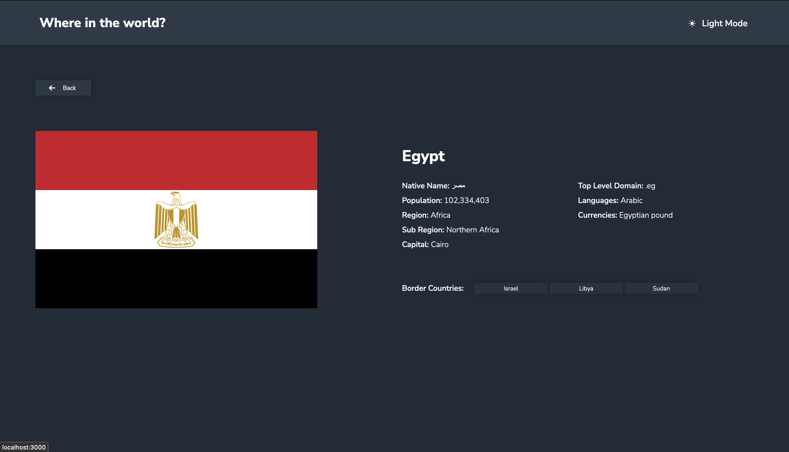
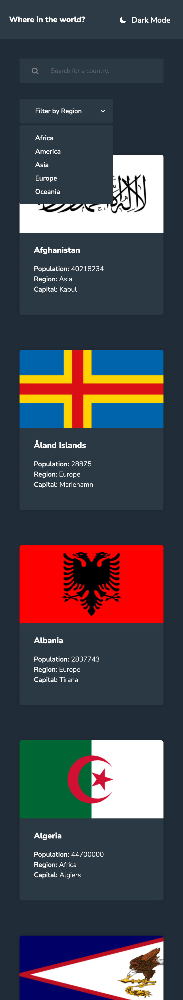

# Frontend Mentor - REST Countries API with color theme switcher solution

This is a solution to the [REST Countries API with color theme switcher challenge on Frontend Mentor](https://www.frontendmentor.io/challenges/rest-countries-api-with-color-theme-switcher-5cacc469fec04111f7b848ca). Frontend Mentor challenges help you improve your coding skills by building realistic projects. 

## Table of contents

- [Overview](#overview)
  - [The challenge](#the-challenge)
  - [Screenshot](#screenshot)
  - [Links](#links)
- [My process](#my-process)
  - [Built with](#built-with)
  - [What I learned](#what-i-learned)
  - [Continued development](#continued-development)
  - [Useful resources](#useful-resources)
- [Author](#author)
- [Acknowledgments](#acknowledgments)

## Overview

### The challenge

Users should be able to:

- See all countries from the API on the homepage
- Search for a country using an `input` field
- Filter countries by region
- Click on a country to see more detailed information on a separate page
- Click through to the border countries on the detail page
- Toggle the color scheme between light and dark mode *(optional)*

### Screenshot

#### Desktop view

#### Mobile view

### Links

- Solution URL: [Github](https://github.com/egstar/WhereInWorld)
- Live Site URL: [Vercel](https://where-in-world-six.vercel.app)

## My process

### Built with

- Semantic HTML5 markup
- CSS custom properties
- Flexbox
- CSS Grid
- Mobile-first workflow
- SVG icons
- [Next.js](https://nextjs.org/) - React framework

### What I learned

Already Experienced with this

### Continued development

Next.js development

### Useful resources

- [Next.js Documentation](https://nextjs.org/docs) - This helped me for my Next.js experience.

## Author

- Website - [Burham Soliman](https://www.burhams.com)
- Frontend Mentor - [EGStar](https://www.frontendmentor.io/profile/egstar)
- Twitter - [Bori0o](https://www.twitter.com/bori0o)

## Acknowledgments

Self work